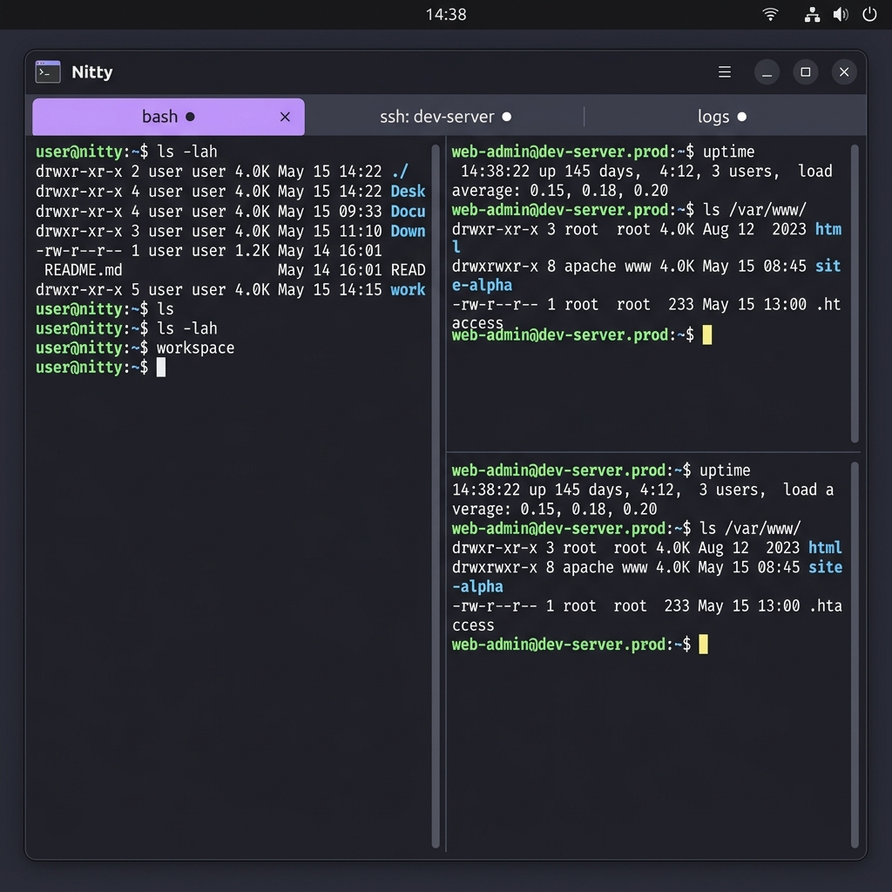
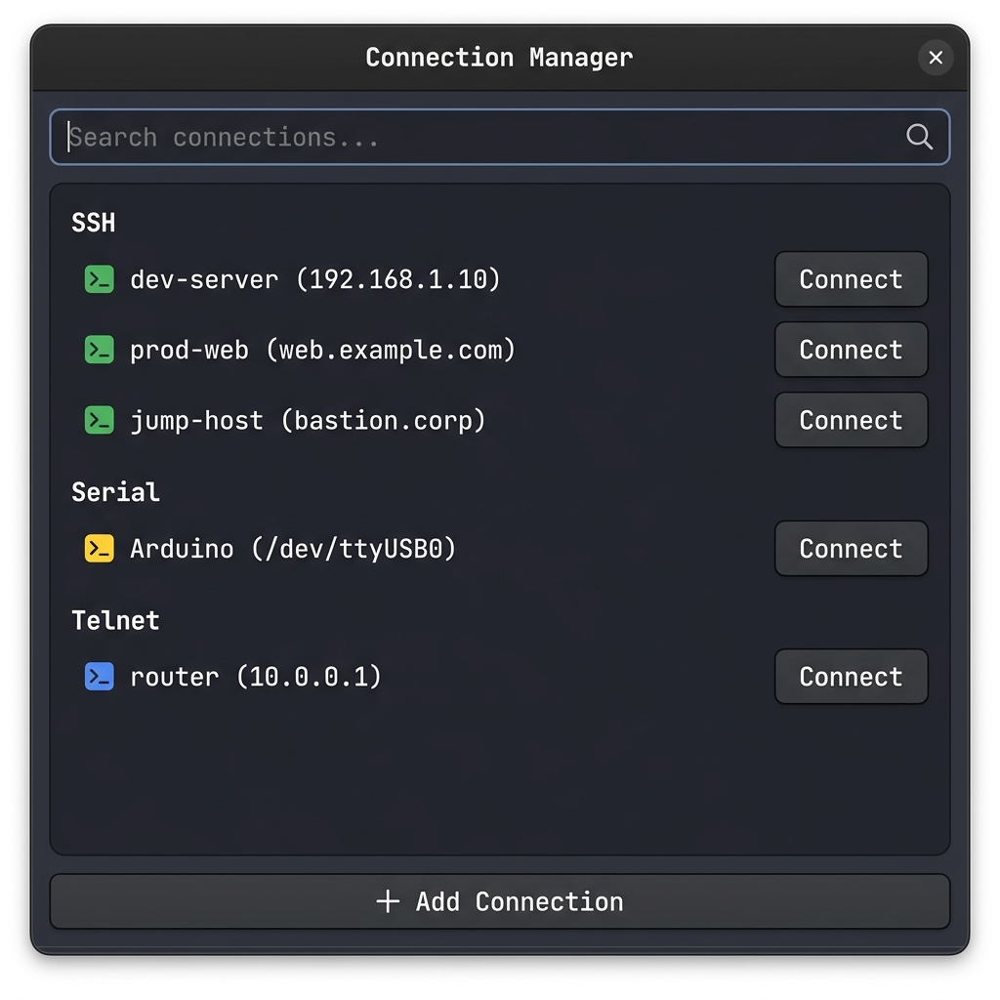
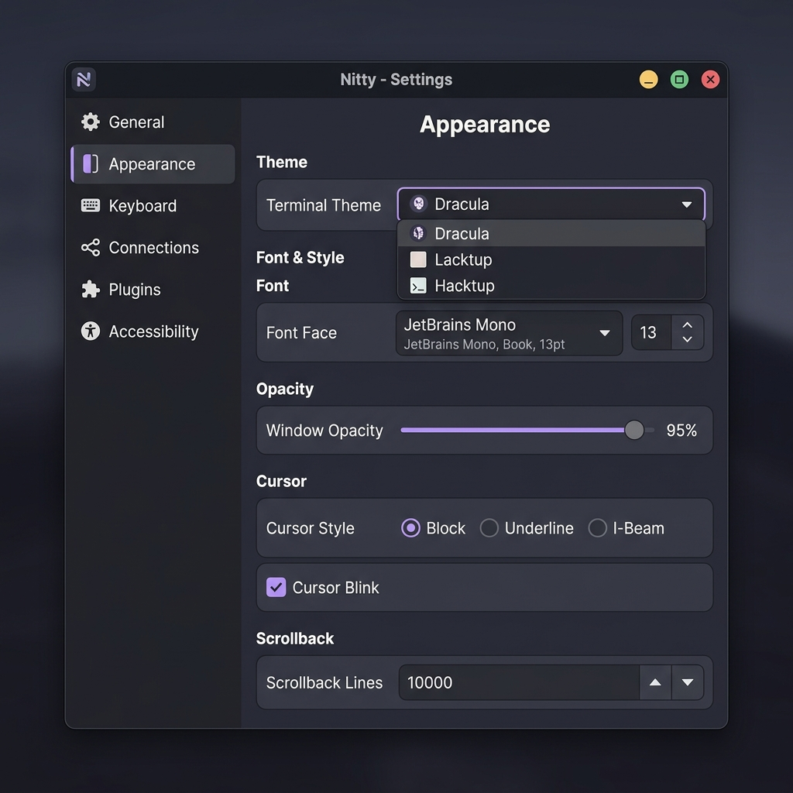
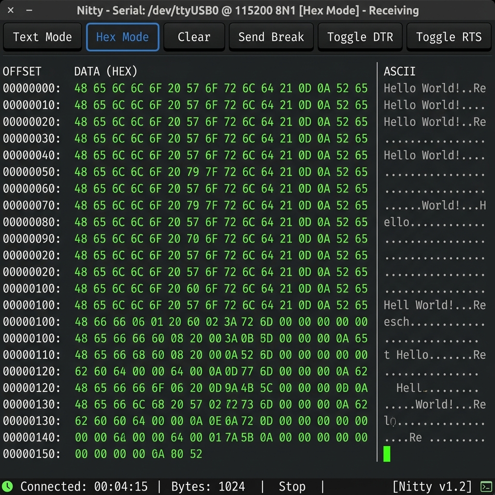

# Nitty

**A full-featured, native terminal emulator written in [Nitpick](https://github.com/alternative-intelligence-cp/nitpick)**

[](https://www.gnu.org/licenses/agpl-3.0)
[](https://github.com/alternative-intelligence-cp/nitty/actions/workflows/ci.yml)
[](https://github.com/alternative-intelligence-cp/nitty/releases/latest)

---



---

## Overview

Nitty is a modern, native terminal emulator built from scratch in the [Nitpick](https://github.com/alternative-intelligence-cp/nitpick) programming language. It delivers feature parity with tools like [Tabby](https://tabby.sh) while using a native GTK4 GUI instead of Electron — resulting in **fast startup, low memory usage, and a truly native desktop experience**.

Nitty is both a serious, production-grade terminal and a showcase for the Nitpick language ecosystem, demonstrating that complex desktop applications can be built entirely in Nitpick.

> **Status: Release Candidate (v0.15.0)** — All core features complete. See [Known Issues](KNOWN_ISSUES.md) and [CHANGELOG](CHANGELOG.md).

---

## Features

### Core Terminal
- Full VT100/VT220/xterm/xterm-256color escape sequence support
- 24-bit true color (16.7M colors) and 256-color rendering
- GPU-accelerated text rendering via GTK4/Cairo
- Unicode, emoji, and Powerline/Nerd Font glyph support
- Configurable scrollback buffer with live search
- Bracketed paste, copy-on-select, multi-line paste warnings
- Bell: audible, visual, and desktop notification modes

### Window Management
- Tabbed terminal sessions with activity notifications
- Horizontal and vertical split panes with BSP tree layout
- Broadcast input to multiple panes simultaneously
- Quake-mode drop-down terminal (global hotkey: `F12`)

### Connections

| Type | Features |
|------|----------|
| **Local Shell** | Any system shell (bash, zsh, fish, etc.) |
| **SSH** | Built-in SSH2 client, connection profiles, jump hosts, port forwarding, SFTP browser, X11 forwarding, agent auth, credential vault |
| **Serial** | Full serial terminal, configurable baud/parity/flow, hexdump mode, Zmodem file transfer, DTR/RTS control |
| **Telnet** | Native Telnet client with IAC option negotiation |

### Configuration
- YAML-based config (`~/.config/nitty/config.yaml`) with hot-reload
- Graphical Settings editor (`Ctrl+Shift+,`)
- Per-connection-type profiles with full TOML serialization
- Fully customizable hotkeys with multi-chord support
- 150+ built-in color themes

### Plugin System
- Extensible via the Plugin API with defined extension points
- **Plugin Manager** (`Ctrl+Shift+P`) — install plugins from a local directory, configure per-plugin settings, enable/disable, and uninstall with full directory cleanup
- Plugin scaffolding script (`scripts/new-plugin.sh`) for creating new plugins
- See the [Plugin Development Guide](docs/plugin-development-guide.md) to get started

---

## Screenshots

| | |
|---|---|
|  |  |
| *Split panes with local shell and SSH session* | *Connection Manager with grouped profiles* |
|  |  |
| *Settings dialog — Appearance panel* | *Serial connection in hexdump mode* |

---

## Installation

### Download Packages

Download the latest release from the [Releases page](https://github.com/alternative-intelligence-cp/nitty/releases/latest).

**Ubuntu / Debian:**
```bash
# Download nitty_<version>_amd64.deb from the Releases page, then:
sudo dpkg -i nitty_*_amd64.deb
```

**Fedora / RHEL:**
```bash
# Download nitty-<version>-1.x86_64.rpm from the Releases page, then:
sudo rpm -i nitty-*.x86_64.rpm
```

**AppImage (any Linux distro):**
```bash
# Download Nitty-<version>-x86_64.AppImage from the Releases page, then:
chmod +x Nitty-*-x86_64.AppImage
./Nitty-*-x86_64.AppImage
```

**Flatpak:**
```bash
# Download Nitty.flatpak from the Releases page, then:
flatpak install --user Nitty.flatpak
flatpak run com.nitty.Terminal
```

---

## Building from Source

### Prerequisites

- **Nitpick compiler** (`npkc`) v0.52.15 or later
- **Nitpick build system** (`npkbld`)
- **LLVM 20**
- GTK4 development headers (`libgtk-4-dev`)
- libssh2 development headers (`libssh2-1-dev`)

### Build

```bash
git clone https://github.com/alternative-intelligence-cp/nitty.git
cd nitty

# Build C shims
make -C shim/gtk4/
make -C shim/libssh2/
make -C shim/pty/
make -C shim/serial/
make -C shim/telnet/

# Build Nitty
npkbld build

# Run
./build/nitty
```

### Run Tests

```bash
npkbld test tests/
bash tests/e2e/run_e2e.sh
```

---

## Configuration

On first launch, Nitty creates `~/.config/nitty/config.yaml` with sensible defaults. Open the graphical settings editor with `Ctrl+Shift+,`, or edit the file directly — it hot-reloads on save.

Key configuration sections:
- `[terminal]` — scrollback, bell, cursor style
- `[appearance]` — theme, font, opacity
- `[hotkeys]` — override any keybinding
- `[quake]` — drop-down mode settings

---

## Keyboard Shortcuts

| Action | Default Shortcut |
|--------|-----------------|
| New Tab | `Ctrl+Shift+T` |
| Close Tab | `Ctrl+Shift+W` |
| Split Horizontal | `Ctrl+Shift+H` |
| Split Vertical | `Ctrl+Shift+V` |
| Navigate Panes | `Alt+Arrow` |
| Settings | `Ctrl+Shift+,` |
| Connection Manager | `Ctrl+Shift+N` |
| Plugin Manager | `Ctrl+Shift+P` |
| Search Scrollback | `Ctrl+Shift+F` |
| Quake Mode Toggle | `F12` |

---

## Related Projects

| Project | Description |
|---------|-------------|
| [nitpick](https://github.com/alternative-intelligence-cp/nitpick) | The Nitpick programming language compiler |
| [nitpick-build](https://github.com/alternative-intelligence-cp/nitpick-build) | Build system for Nitpick projects |
| [nitpick-packages](https://github.com/alternative-intelligence-cp/nitpick-packages) | 105+ standard library packages |
| [nitpick-libc](https://github.com/alternative-intelligence-cp/nitpick-libc) | Pure Nitpick libc implementation |
| [nitpick-docs](https://github.com/alternative-intelligence-cp/nitpick-docs) | Language documentation and guides |
| [nikos](https://github.com/alternative-intelligence-cp/nikos) | Static analyzer (NASA IKOS fork) |

---

## Known Issues

See [KNOWN_ISSUES.md](KNOWN_ISSUES.md) for a full list of tracked limitations.

---

## Contributing

Nitty is developed by the Alternative Intelligence CP team. Contributions are welcome.

Please see [CONTRIBUTING.md](CONTRIBUTING.md) for guidelines.

---

## License

This project is licensed under the **GNU Affero General Public License v3.0** — see the [LICENSE](LICENSE) file for details.

## Acknowledgments

- **[Tabby](https://tabby.sh)** by Eugene Pankov — Feature reference and inspiration
- **[Nitpick](https://github.com/alternative-intelligence-cp/nitpick)** — The programming language that makes this possible
