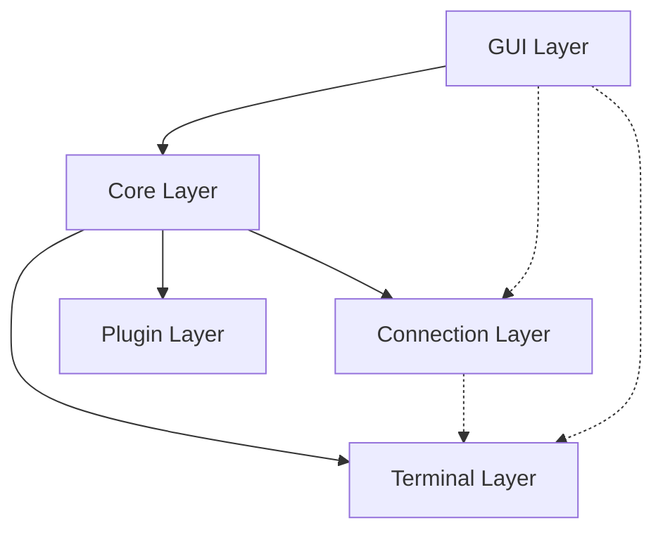

# Nitty Architecture Overview

This document describes the high-level architecture of Nitty, detailing how its subsystems interact, the data flows from input to screen, and its concurrency and memory models.

## High-Level System Architecture

Nitty is structured into five distinct layers:

1. **GUI Layer (`src/gui/`):** Responsible for GTK4 window management, rendering the grid via Cairo/Pango, tab management, and handling user input events.
2. **Core Layer (`src/core/`):** Manages global application state, the hotkey engine, pane/tab lifecycles, and configuration.
3. **Terminal Layer (`src/terminal/`):** The engine of the emulator. Contains the VT parser, terminal state (grid, scrollback, cursor), and the PTY interface for local shells.
4. **Connection Layer (`src/ssh/`, `src/serial/`, `src/telnet/`):** Implements protocols for remote connections. These integrate with the terminal layer identically to local PTYs.
5. **Plugin Layer (`src/plugin/`):** Manages the lifecycle and execution of user-provided plugins via the Plugin Safe Path API and Extension Point hooks.

## Data Flow Paths

### Input Path (Keyboard to Action)
1. **GTK4 Event:** A key press is intercepted by `shim/gtk4_shim.c`.
2. **Event Translation:** The C shim calls `nitty_gtk4_on_key_pressed` (in `input.npk`).
3. **Hotkey Engine:** The keyval and modifiers are passed to `hk_handle_key()` in `hotkey.npk`.
4. **Action Dispatch:** If a chord matches, it returns an action string (e.g., `"tab.new"`), which is processed by `dispatch_action()`.
5. **PTY Write:** If no hotkey matches, the character is encoded to UTF-8/escape sequences and written to the active pane's file descriptor (PTY, SSH channel, or Serial port).

### Output Path (Data to Screen)
1. **Epoll/Read:** The global GTK event loop triggers a read on an active file descriptor.
2. **VT Parser:** Data is read into a buffer and fed to `vt_parse()` in `vt_parser.npk`.
3. **State Mutation:** The parser triggers actions in `terminal_pipeline.npk`, modifying the `TerminalState` (writing to the grid, scrolling, moving the cursor).
4. **Dirty Tracking:** Any modified grid cell is marked dirty in `dirty_tracker.npk`.
5. **Render Sync:** Before drawing, `renderer_sync_frame()` flushes dirty Nitpick cells to a static C-side render buffer.
6. **Screen Draw:** The GTK4 draw signal fires, iterating over the C-side buffer and rendering glyphs using Pango.

### Remote Connections (SSH & Serial)
Remote connections substitute the local PTY file descriptor with a socket or device FD.
- **SSH Data Path:** TCP socket → `libssh2` buffer → SSH channel read → VT parser.
- **Serial Data Path:** `/dev/ttyUSBx` → epoll read → hex/text mode processing → VT parser.

## Threading Model

Nitty uses a **single-threaded, asynchronous, event-driven** model to maximize safety and avoid locks.

- **Main Thread:** Everything runs on the main GTK4 UI thread.
- **Asynchronous IO:** All file descriptors (PTY, sockets, serial ports) are set to non-blocking and registered with the GTK main loop (via `g_source_attach`).
- **Callbacks:** Read/Write readiness triggers synchronous Nitpick callbacks that parse data in small, bounded chunks to ensure UI responsiveness.

## Memory Ownership Model

Nitpick is a garbage-collected language, but interacting with C (via GTK4 and LibSSH2) requires careful boundary management.

- **Nitpick → C:** C pointers (e.g., GTK widgets) are stored as opaque `int64` handles in Nitpick structs. The C layer owns the widget lifecycle, while Nitpick triggers destruction (e.g., `nitty_gtk4_window_close()`).
- **C → Nitpick:** C callbacks into Nitpick must never retain references to Nitpick strings or arrays, as the GC may move or collect them. Data is either copied synchronously into static C buffers (like the render grid) or processed immediately.
- **Terminal State:** Owned uniquely by a `Pane` struct. When a tab is closed, the pane is dropped, and the GC reclaims the scrollback and grid.
