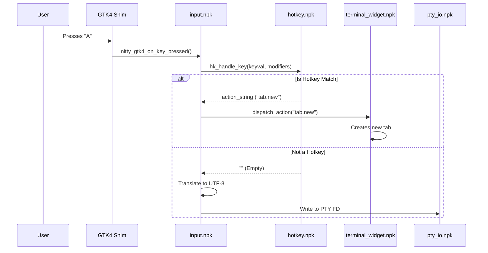
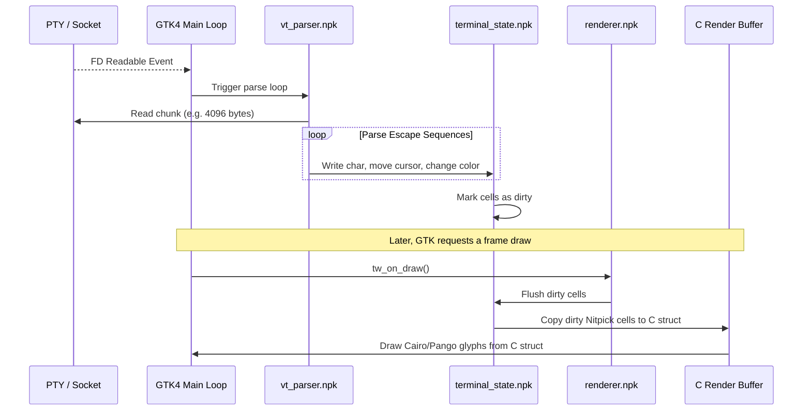
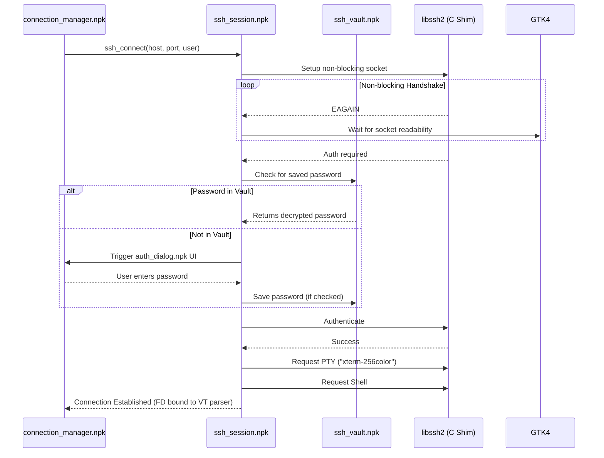

# Data Flow Diagrams

These sequence diagrams illustrate the data flow for critical paths in Nitty's operation.

## 1. Input Flow (Keypress to Screen)

## 2. Output Flow (Screen Draw)

## 3. SSH Connection Handshake

