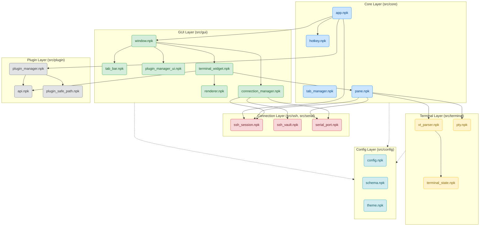

# Dependency Diagram

The following Mermaid graph visualizes Nitty's high-level module dependencies. Nitty enforces a strict, layered architecture to prevent circular dependencies (which Nitpick does not support).

## Dependency Rules
1. **GUI depends on Core and Config.**
2. **Core depends on Terminal, Connection, and Plugin Layers.**
3. **Terminal depends *only* on Config and Libc bindings.**
4. **No circular imports.** If module A imports module B, B cannot import A. Shared state must be hoisted to a common dependency (like `constants.npk` or `schema.npk`).
